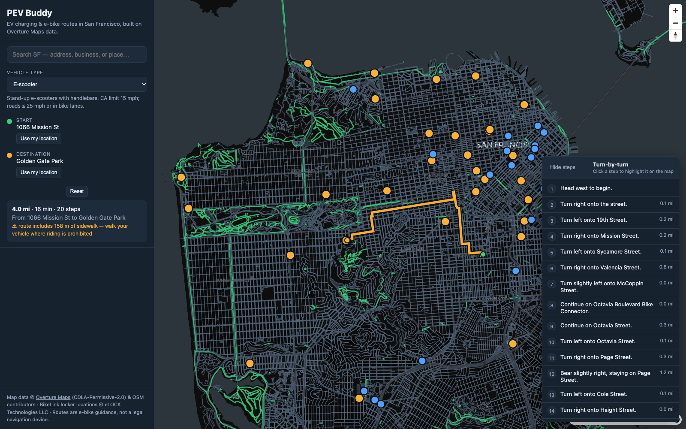
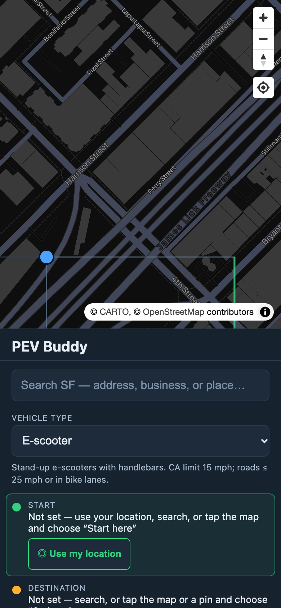
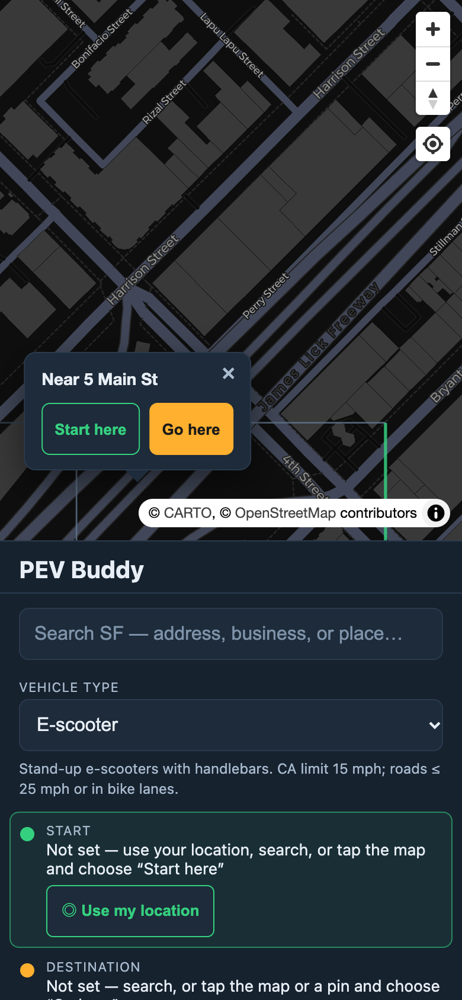
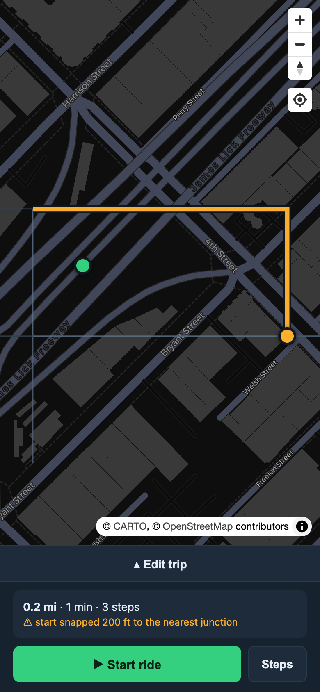
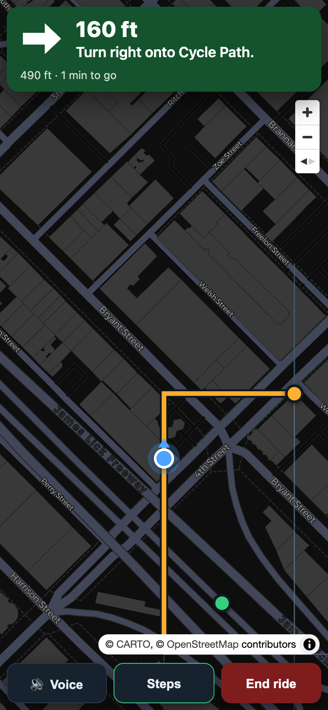

# PEV Buddy

**PEV Buddy is turn-by-turn navigation for e-bikes, e-scooters, and mopeds in
San Francisco — from anywhere to anywhere, weighing every street by its speed
and your vehicle's legal access — plus a map of EV chargers, secure BikeLink
lockers, and ~6k sidewalk bike racks along the way. Built entirely on
[Overture Maps](https://overturemaps.org) and other open data.**

[](https://github.com/imhotep/pev-buddy/actions/workflows/test.yml)

**Live: [pev-buddy.anislab.com](https://pev-buddy.anislab.com)** — open it in
your phone's browser, or add it to your home screen
([how](#use-it-on-your-phone)). Tap **Start ride** and it guides you
hands-free: a big next-turn banner, voice prompts, and automatic rerouting.



## Use it on your phone

PEV Buddy is a web app: it works the same in a mobile browser as when
installed. Installing just gives it a home-screen icon and a full-screen
window. The phone-specific bits (the location button and compass heading-up
while riding) turn on for any touch screen (`pointer: coarse`), installed
or not.

**iPhone (Safari)**

1. Open [pev-buddy.anislab.com](https://pev-buddy.anislab.com) in **Safari**.
2. Tap **Share** (the square with an up arrow) → **Add to Home Screen** → **Add**.
3. Open it from the home screen. Allow **Location** when asked. When you tap
   **Start ride**, allow **Motion & Orientation** too: that is the compass
   that turns the map to face your direction of travel.
4. If you dismissed a prompt: **Settings → Privacy & Security → Location
   Services → Safari Websites → While Using the App**. Motion access is
   re-asked on the next **Start ride**.

**Android (Chrome)**

1. Open [pev-buddy.anislab.com](https://pev-buddy.anislab.com) in **Chrome**.
2. Tap **⋮** → **Install app** (or **Add to Home screen**) → **Install**.
3. Open it and allow **Location** when asked. If you blocked it: tap the
   site-settings icon left of the address → **Permissions → Location → Allow**.

**Riding with it**

1. **Set a start.** Tap **◎ Use my location**, or search, or tap the map and
   choose **Start here**.
2. **Set a destination.** Search, or tap the map (or any charger, locker, or
   rack pin) and choose **Go here**. Drag either pin to adjust; picked points
   are labeled by the nearest address.
3. **Pick your vehicle type.** The route follows California law for it.
4. **Tap ▶ Start ride** and put the phone in its mount. The banner shows the
   next turn and a live countdown in feet/miles. Voice says "In 500 feet,
   turn right onto …" and again just before the turn. It advances by itself
   as you pass each turn, reroutes if you leave the route, and keeps the
   screen on.
5. **🔊 Voice** mutes or unmutes (remembered). **Steps** shows the whole list.
   **Re-center** appears after you pan the map. **End ride** goes back to
   the overview.

Phone, on the synthetic test network the browser tests use (so the
street names don't match the basemap): empty state, tapping the map,
a route, and ride mode.

<p>
  
  
  
  
</p>

Desktop (1280×800):
[empty](docs/ux/desktop-1-empty.png) ·
[map-click popup](docs/ux/desktop-2-pick-popup.png) ·
[route](docs/ux/desktop-3-route.png) ·
[ride mode](docs/ux/desktop-4-ride.png)

## Why this

Riding an e-bike or e-scooter in San Francisco means asking *"how do I get
there without ending up in 45 mph traffic?"* — and existing nav apps don't
answer it. PEV Buddy is built around that question: it routes between any two
points in the city (an address, a place, a charger, a rack, or a tap on the
map) with turn-by-turn steps. Instead of a hard
"≤ 25 mph only" filter, the router is **speed-differential** and
**vehicle-aware**: you pick your CA vehicle type (e-scooter, e-skateboard,
EUC, Class 1/2/3 e-bike, moped — e-motos are shown but blocked, since they're
not street-legal), and every street is categorized by its effective speed
limit (posted limit, or a per-class default when Overture doesn't post one)
and checked against that vehicle's road-access rule (e-scooters/EUCs:
≤ 25 mph or in bike lanes; e-boards: under 35 mph; e-bikes/mopeds: no
road-speed restriction) and priced by its cost profile — bike lanes and quiet
streets are cheap, shared streets cost more, arterials cost more still, and
anything above 45 mph is excluded outright. One-way streets, prohibited
turns, and Overture access rules (bicycle mode for most types, motorcycle
mode for mopeds) are respected, not just ignored.

Charging and parking are part of the ride, so they're on the same map:
SF's EV chargers from Overture, [BikeLink](https://bikelink.org) secure
lockers, and the SFMTA's official
[bicycle rack inventory](https://data.sf.gov/Transportation/Bicycle-Parking-Racks/hn4j-6fx5)
(~6k sidewalk racks and on-street corrals). All three POI kinds share one
clustered map layer: count bubbles when zoomed out, colored pins (amber
chargers, blue lockers, violet racks) when zoomed in.

## How it works

1. **Extraction** (`python -m pev_buddy.sync`) pulls five Overture slices for SF
   from their S3 bucket, plus the SF BikeLink locker slice, and writes compact
   static files into `data/`:

   | file | source | notes |
   |---|---|---|
   | `roads.geojson` | Overture `transportation/segment` | roads only, trimmed to routing-relevant fields |
   | `connectors.json` | Overture `transportation/connector` | junction nodes |
   | `stations.geojson` | Overture `place` (`basic_category: ev_charging_station`) | 40 SF chargers |
   | `places.json` | Overture `place` (all other named places) | ~81k businesses/POIs for place search |
   | `addresses.parquet` | Overture `addresses/address` | ~433k addresses for search |
   | `bikelink.geojson` | [bikelink.org](https://bikelink.org) `/maps` payload | SF secure bike/PEV lockers (eLockers, hangars, group parking), ~29 sites |
   | `racks.geojson` | [DataSF / SFMTA](https://data.sf.gov/Transportation/Bicycle-Parking-Racks/hn4j-6fx5) SODA API | ~6k sidewalk bike racks + on-street corrals, with space counts and install year |

2. **Routing** (`src/pev_buddy/`) builds one directed *union* graph from
   segments + connectors (every edge any vehicle type may ride) and runs A*
   over `(node, incoming-edge)` states so U-turns and Overture's
   `prohibited_transitions` are handled correctly. At build time each
   vehicle type gets a 1-byte allow bitmap per edge (and per node, for
   snapping), so per-vehicle routing is a bitmap check plus a cost lookup.

   **Runtime bundle.** At the end of `sync`, the graph is compiled once into
   `graph.npz` + `graph_meta.json` (numpy arrays + vocabulary-coded
   metadata), and addresses into `addresses.npz` + `addresses_meta.json`.
   The server loads these directly — no 39 MB geojson parse at boot, no
   per-row Python dicts, no pyarrow at runtime. Measured on the full SF
   slice: **~316 MB RSS and ~0.4 s warm-up, vs ~960 MB and 1.6 s** when
   building from the raw slices — small enough to share a 1–2 GB VPS with
   other apps. Byte-level parity between the bundle and raw-slice
   paths is enforced by tests (`tests/test_bundle.py`). Full write-up with
   measurements: [docs/memory-optimization.md](docs/memory-optimization.md).

   **CA vehicle types.** All vehicle types are defined as data in
   `src/pev_buddy/config.py` (`VEHICLE_TYPES`); the UI dropdown, the API, and
   the router all read from it. Each type carries its label, description,
   own speed limit, road-access rule (`road_max_mph`, e.g. the e-scooter's
   ≤ 25 mph / boards' under-35 mph), whether bike lanes are exempt from that
   limit, which Overture access mode applies (bicycle; motorcycle for
   mopeds), and a cost profile:

   | id | label | road access | profile |
   |---|---|---|---|
   | `scooter` (default) | E-scooter | roads ≤ 25 mph or in bike lanes | A |
   | `emb` | E-skateboard / Onewheel | roads under 35 mph | A |
   | `euc` | Electric unicycle | same as `scooter` (conservative) | A |
   | `ebike_c1` / `ebike_c2` | Class 1/2 e-bike | no road-speed restriction | A |
   | `ebike_c3` | Class 3 e-bike | no road-speed restriction | B |
   | `moped` | Moped | motor-vehicle rules | C |
   | `emoto` | E-moto | not street-legal — shown in the UI, but route requests are blocked | — |

   **Speed-differential cost model.** Each segment heading gets a category —
   `bike_lane` (cycleway/path/track or a designated bicycle facility),
   `living_street`, `sidewalk` (footway: a high-cost walk-your-vehicle
   connector), or a speed band from its effective limit (posted limit wins
   over the per-class default, e.g. residential 25 / tertiary 30 / secondary
   40 / motorway 65): `quiet` ≤ 20 mph, `shared` 20–28, `arterial` 28–45.
   Cost is `length_m × cost_profile[category]` (e.g. arterial = 3.0× for
   profile A, 1.6× for B, 1.0× for C — dedicated bike lanes are 3.0× for
   mopeds, which are usually bicycle-only). Effective limit > 45 mph is
   excluded for every vehicle type, as are stairs/bridleways; Overture
   `access_restrictions` clear the corresponding heading bits per access
   mode. The API reports a per-category `segment_stats` breakdown with
   warnings for sidewalk sections, fast arterials, shared roadways, and —
   for mopeds — dedicated bike lanes.

3. **API** (FastAPI) serves the static files plus `/api/route` (takes a
   `vehicle` type; blocks non-street-legal ones), `/api/vehicles` (the
   vehicle types + default, straight from config), `/api/search` (unified
   addresses + places/POIs + charging stations, ranked), `/api/reverse`
   (nearest-address label for a map-picked point), `/api/geocode`, and
   `/api/stations`.

4. **UI** is a dependency-free vanilla-JS + MapLibre GL single page,
   installable as a PWA: dark map with the rideable network drawn, all three
   POI kinds on one clustered layer (count bubbles zoomed out, colored pins
   zoomed in), a vehicle type dropdown (options + description loaded from
   `/api/vehicles`) with a live description line, a unified search that
   accepts any address, business, or POI for either start or destination
   (plus tap-the-map "Start here / Go here", draggable pins, and GPS), and a
   turn-by-turn panel where each step can be highlighted on the map.
   **Ride mode** (Start ride) is hands-free: GPS fixes are snapped to the
   route, the next-maneuver banner and voice prompts advance on their own,
   leaving the route for a few fixes reroutes from where you are, and the map
   follows you heading-up (GPS course when moving, compass otherwise) with
   the screen kept awake. The progress logic is plain functions in `app.js`
   (`snapToRoute`, `nextManeuver`, `offRouteCount`, …) with browser tests
   that replay a scripted GPS track.

## Run it

```bash
python -m venv .venv && . .venv/bin/activate
pip install -r requirements.txt
python -m pev_buddy.sync        # extract the SF Overture slice (~50 MB)
uvicorn pev_buddy.api:app --reload
# open http://localhost:8000
```

Tests: `pytest`. The Python suite is offline/synthetic (no S3
calls); `tests/test_frontend.py` drives the real UI in headless Chrome via
Playwright (system Chrome, `channel="chrome"` — no browser download) and
skips automatically when Chrome is unavailable. CI runs the suite on every
push (`.github/workflows/test.yml`).

## Deploy

Production runs on a small VPS: a systemd unit serves uvicorn on
`127.0.0.1:8765`, and [Caddy](https://caddyserver.com) fronts it with
automatic Let's Encrypt HTTPS (`deploy/Caddyfile` — one `reverse_proxy` block
per subdomain, so other apps can share the box). `deploy/setup.sh` installs or
updates the app on a Debian/Ubuntu VPS (deps, data bundle, systemd unit):

```bash
git clone https://github.com/imhotep/pev-buddy.git && bash pev-buddy/deploy/setup.sh
```

It builds the data bundle on first run (`--sync` to refresh it later).
Building the bundle needs ~1.5 GB free RAM; on a small or busy VPS, build
locally and push instead: `rsync -az data/ <host>:~/pev-buddy/data/`.

### Self-host behind Tailscale

If the box has no public IP (or you don't want to open one), `setup.sh` can
expose **only** this app publicly via
[Tailscale Funnel](https://tailscale.com/kb/1223/funnel) — the rest of the
node stays tailnet-only. The app is then live at
`https://<node>.<tailnet>.ts.net` with TLS handled by Tailscale. Sharing the
node with another public app? Funnel supports ports 443, 8443, and 10000 per
node, e.g. `PORT=8765 FUNNEL_PORT=8443 bash deploy/setup.sh` puts PEV Buddy at
`https://<node>.<tailnet>.ts.net:8443` while the other app keeps 443.

## Decisions & judgment calls

The trade-offs section below lists what I cut; this one is why the core design
looks the way it does.

- **Soft costs, not hard filters.** Streets are priced by category (bike lane,
  quiet, shared, arterial) instead of forbidden outright, so a destination
  walled in by fast roads still gets a route — with a visible warning — rather
  than a dead "no route" error. Only genuinely unridden classes (stairs,
  bridleways, > 45 mph) are excluded.
- **One union graph + per-vehicle bitmaps.** All seven routable vehicle types
  share a single directed graph; legality per type is a 1-byte bitmap per edge
  computed once at build time. Routing for any vehicle is then a bitmap check
  plus a cost lookup — no per-vehicle graphs, no runtime rule evaluation.
- **Compile at sync time, not boot time.** The graph and geocoder are packed
  into numpy/vocab-coded bundles during `sync` (on the build machine), so the
  server never parses 39 MB of geojson or imports pyarrow. Measured on the
  full SF slice: ~960 MB → ~316 MB RSS and 1.6 s → 0.4 s warm-up, so the app
  shares a small VPS with other workloads instead of needing one to itself.
  Parity between
  the bundle and raw-slice paths is pinned by tests, not assumed.
- **Vehicle law as data.** CA vehicle types (speed caps, road-access rules,
  bike-lane exemptions, Overture access mode) live in one config table that
  the UI, API, and router all read; per-city overrides can layer on without
  touching the router.
- **Honesty over polish.** No live traffic, no plug counts, no availability —
  the UI surfaces exactly what the data knows and links out for the rest,
  including a visible disclaimer that routes are advisory.

Built with AI pair-programming throughout (explicitly allowed by the
assignment); the problem choice, architecture, design decisions above, and the
measurement-driven verification are mine.

## Key trade-offs & cuts (v1)

- **Static city slice.** Data is extracted once and served from disk (no live
  Overture queries), which keeps the app fast and cheap to host. Stale
  between syncs; re-run `sync` to refresh.
- **Routing is *advisory*, not live.** No traffic, no closed lanes, no
  bike-signal awareness. Costs are distance × per-(vehicle-type, category)
  preference (bike lanes and quiet streets preferred), not travel-time
  estimation. Road-access rules are data in `config.VEHICLE_TYPES`, so
  per-city overrides can be layered on without touching the router.
- **Chargers are station-level only.** Overture places carry names/brands/
  addresses but not plug counts, kW, or live availability — the UI honestly
  says what it knows and links out for the rest.
- **Speeds are inferred when unposted.** Overture doesn't post a speed on
  every street, so unposted streets fall back to per-class defaults
  (`SPEED_BY_CLASS_DEFAULT_MPH`); a posted limit always wins. Mode-scoped
  speed limits (e.g. hgv-only) are ignored, and nothing above 45 mph is ever
  routed. The result is a *soft* speed policy — fast streets are expensive,
  not forbidden — so a walled-in destination is still reachable via an
  arterial (with a warning) instead of a dead "no route" error.
- **Turns are geometry-derived.** Instructions come from bearings between
  segment endpoints plus Overture signpost `destinations` where available;
  there's no per-intersection camera-style guidance.

## Data & licenses

Map data: [Overture Maps](https://overturemaps.org), released under
[CDLA-Permissive-2.0](https://cdla.dev/permissive-2-0/), with
OSM-derived upstream attribution. Basemap tiles: CARTO. BikeLink locker
locations: [bikelink.org](https://bikelink.org) (© eLOCK Technologies LLC),
pulled from the public locations page at sync time — the slice is refresh
stable and small, and a failed pull never breaks the build. Bike racks:
SFMTA's [Bicycle Parking Racks](https://data.sf.gov/Transportation/Bicycle-Parking-Racks/hn4j-6fx5)
dataset on DataSF (public domain / PDDL), pulled from the Socrata SODA API at
sync time the same way.
